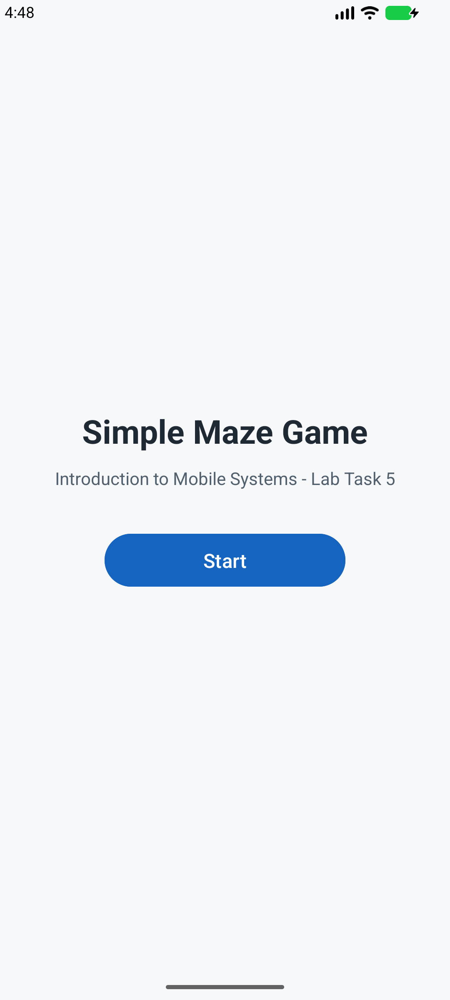
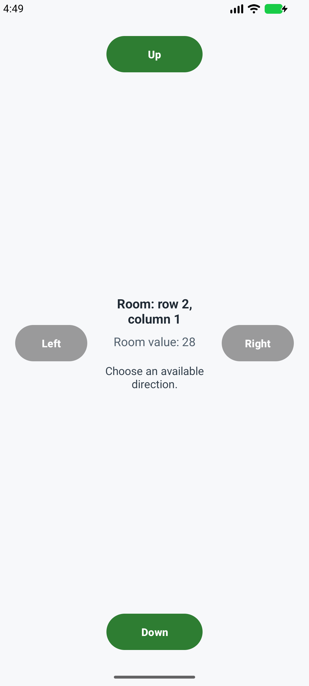
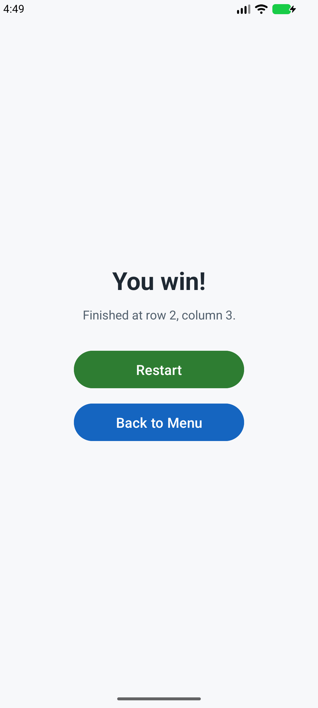

# Simple Maze Game

Course name: Introduction to Mobile Systems  
Lab number: Lab Task 5  
Student name: Cem Cakir  
Student ID: 44463

## Description

Simple Maze Game is an Android Studio project written in Java. The app implements a room-based maze where each room is stored in a 2D integer grid and movement is controlled by bitmask door values. The default 4x4 maze uses bit 16 to mark the start room at row 2, column 1, and the game finishes immediately when the player reaches the room with value 0 at row 2, column 3.

## Features

- Start screen with a Start button.
- Single-Activity room screen that updates immediately after each valid direction move.
- Maze stored as an `int[][]` grid using door bits: left `1`, right `2`, up `4`, down `8`.
- Start marker bit `16` is ignored for movement availability.
- Invalid and out-of-bounds moves are blocked.
- Direction buttons are green when available and gray/disabled when blocked.
- Result screen shows a clear win message with Restart and Back to Menu buttons.

## Screenshots

| Start screen | Room screen | Result screen |
| --- | --- | --- |
|  |  |  |

## APK

GitHub Release APK link: https://github.com/Agueria/SimpleMazeGame/releases/tag/lab-task-5

The APK attached to the release is built from this project with:

```bash
./gradlew assembleDebug
```

## Build And Test

Use Android Studio or the Gradle wrapper:

```bash
./gradlew assembleDebug
./gradlew testDebugUnitTest
./gradlew connectedDebugAndroidTest
```

The connected Android test covers the main flow: start the game, verify enabled/disabled direction buttons, navigate the sample maze, and reach the result screen.
